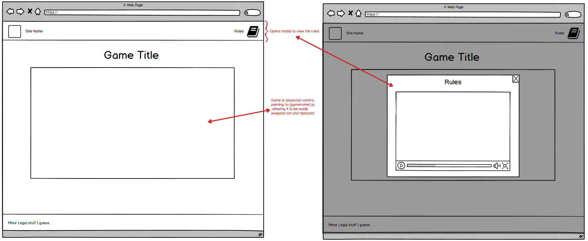
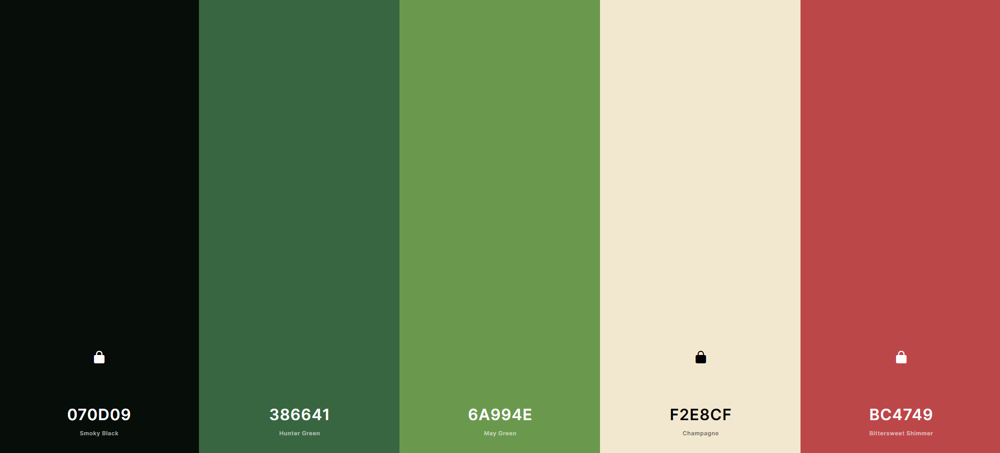

# Javascript Blackjack

The project's end-goal is the creation of a site for the hosting of a 
JavaScript implementation of blackjack, with an extensible design allowing 
for the potential future implementation of more games on the site.
 
This will create value for both the user, as it wil allow for online entertainment via the playing of the provided games,
and value for the site-owner, as they will be able to play the games on the site, and potential add new games via the template site formatting.

## UX

### Strategy
The aim is to develop and deploy a site for the hosting and playing of JavaScript-based games; with an extensible design for the possible implementation of additional games in disparate formats; An intuitive to navigate site layout; and the implementation of atleast one game.  

The first task in this project was to research the layout of site with a similar objective to provide an experience that is proven to work, and be immediately familiar to anyone that may have used one of those sites.
Then the full rules of blackjack for both player and dealer needed to be researched and recorded, to ensure a complete and authentic gameplay experience.

### Scope
Minimum Viable Product consists of: A single game's page, and a javascript implementation of blackjack. 

### Structure
To provide the proper elements for the javascript to funciton cleanly and efficiently IDs for the rules modal, game container, and associated buttons will be added to their respective elements, along with structuring the page so that these elements are easy to locate if aught needs changing.
No data beyond the site itself and the scripts therein will be held server-side, as no log-in or data entry is required. Beyond the running of the game itself, some data will be stored clientside, that being win/loss rate data, along with the potential for some other miscellaneous stats.

### Skeleton

### Surface

#### User Stories

## Features

In this section, you should go over the different parts of your project, and describe each in a sentence or so.
 
### Existing Features
- Feature 1 - allows users X to achieve Y, by having them fill out Z
- ...

For some/all of your features, you may choose to reference the specific project files that implement them, although this is entirely optional.

In addition, you may also use this section to discuss plans for additional features to be implemented in the future:

### Features Left to Implement
- Another feature idea

## Technologies Used

In this section, you should mention all of the languages, frameworks, libraries, and any other tools that you have used to construct this project. For each, provide its name, a link to its official site and a short sentence of why it was used.

- [JQuery](https://jquery.com)
    - The project uses **JQuery** to simplify DOM manipulation.

## Testing

In this section, you need to convince the assessor that you have conducted enough testing to legitimately believe that the site works well. Essentially, in this part you will want to go over all of your user stories from the UX section and ensure that they all work as intended, with the project providing an easy and straightforward way for the users to achieve their goals.

Whenever it is feasible, prefer to automate your tests, and if you've done so, provide a brief explanation of your approach, link to the test file(s) and explain how to run them.

For any scenarios that have not been automated, test the user stories manually and provide as much detail as is relevant. A particularly useful form for describing your testing process is via scenarios, such as:

1. Contact form:
    1. Go to the "Contact Us" page
    2. Try to submit the empty form and verify that an error message about the required fields appears
    3. Try to submit the form with an invalid email address and verify that a relevant error message appears
    4. Try to submit the form with all inputs valid and verify that a success message appears.

In addition, you should mention in this section how your project looks and works on different browsers and screen sizes.

You should also mention in this section any interesting bugs or problems you discovered during your testing, even if you haven't addressed them yet.

If this section grows too long, you may want to split it off into a separate file and link to it from here.

## Deployment

This section should describe the process you went through to deploy the project to a hosting platform (e.g. GitHub Pages or Heroku).

In particular, you should provide all details of the differences between the deployed version and the development version, if any, including:
- Different values for environment variables (Heroku Config Vars)?
- Different configuration files?
- Separate git branch?

In addition, if it is not obvious, you should also describe how to run your code locally.

## Credits

### Content
- The text for section Y was copied from the [Wikipedia article Z](https://en.wikipedia.org/wiki/Z)

### Media
- Card art obtained from https://github.com/hayeah/playing-cards-assets
- Colour Palette generated with https://coolors.co/

### Acknowledgements

- I received inspiration for this project from X