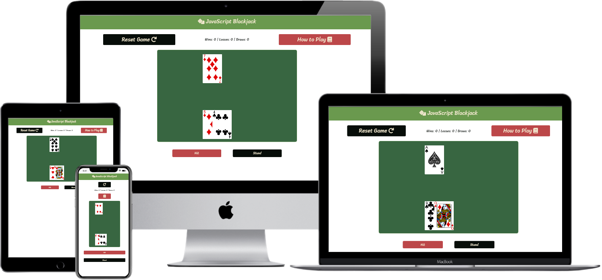

# Javascript Blackjack

The project's end-goal is the creation of a site for the hosting of a 
JavaScript implementation of blackjack, with an extensible design allowing 
for the potential future implementation of more games on the site.
 
This will create value for both the user, as it wil allow for online entertainment via the playing of the provided games,
and value for the site-owner, as they will be able to play the games on the site, and potential add new games via the template site formatting.

## Demo
A live demo version can be found here: [Github Pages](https://pokeymcfork.github.io/IF-Milestone-Project/)

## UX

### Strategy
The aim is to develop and deploy a site for the hosting and playing of JavaScript-based games; with an extensible design for the possible implementation of additional games in disparate formats; An intuitive to navigate site layout; and the implementation of atleast one game.  

The first task in this project was to research the layout of site with a similar objective to provide an experience that is proven to work, and be immediately familiar to anyone that may have used one of those sites.
Then the full rules of blackjack for both player and dealer needed to be researched and recorded, to ensure a complete and authentic gameplay experience.

### Scope
Minimum Viable Product consists of: A single game's page, and a javascript implementation of blackjack. 

### Structure
To provide the proper elements for the javascript to funciton cleanly and efficiently IDs for the rules modal, game container, and associated buttons will be added to their respective elements, along with structuring the page so that these elements are easy to locate if aught needs changing.
No data beyond the site itself and the scripts therein will be held server-side, as no log-in or data entry is required. Beyond the running of the game itself, some data will be stored clientside, that being win/loss rate data, along with the potential for some other miscellaneous stats.

### Skeleton

### Surface

Additionally, card art was found in both PNG and SVG format, but PNG was chosen as the SVG versions were missing the card back.

#### User Stories & Breakdown Thereof

Due to the nature of the site, the pretty much all the user stories are going to apply to a site owner.

- As a User, I want to be able to view a video of the rules, or read a write up of them so that I can understand and enjoy the game.
    - Button to show rules
        - Button opens modal with youtube video (possibly with a toggle to show text instead, as per the user's preference, time permitting.)
        - Modal needs: close button, background darkening, main element, youtube video embed (toggle button, text of rules), and appropriate scripting to perform this. 

- As a User, I want to see my own hand, along with one card of the dealer's so that I can make an informed decision on what move to make.
    - Display user's hand as they play
        - Use card art mentioned in media section
        - card art needs to be displayed as necessary, with the possiblity of simplistic animations to immerse the user.
        - dealer's hand needs special consideration, as functionality to have card hidden until end is nessicary.

- As a User, I want to see and interact with a replay button so that I can continue to play the game and enjoy myself.
    - when the game hits an END state, needs to display a simple replay button, possibly along with a 'you win'/'you lose' thing.

- As a User, I want to have a clear website design with a sensible colour palette so that I can easliy read the website.
    - Decided on the aforeshown colour palette, as it is both fairly readable and reminiscent of a cards table.
        - Despite this, will still need to be careful about useage of colour in page due to the red/green colour palette lining up with the most common form of colour blindness.

## Features

The page features a game container that is shown/created when the 'start game' button is clicked, within which runs a javascript based game of blackjack. The game handles the multiple win conditions for a basic ruleset, along with tracking for the palyer's win and loss rate.
Additionally, the page features a modal that is shown when the 'How to play' button is clicked, featuring an embedded youtube video of an explaination of the rules, along with a text section that can be viewed by clicking the button labled to show it, that has a brief explaination of the rules. 

## Technologies Used

In this section, you should mention all of the languages, frameworks, libraries, and any other tools that you have used to construct this project. For each, provide its name, a link to its official site and a short sentence of why it was used.

- [Bootstrap](https://getbootstrap.com/)
    - Used for simplifying page layout.
    - Requirements:
        - [JQuery](https://jquery.com/)

- [Fontawesome](https://fontawesome.com/)
    - Icons

- [Google Fonts](https://fonts.google.com/)
    - Fonts

- Code Validators
    - [HTML - W3 Markup Validator](https://validator.w3.org/)
    - [CSS - W3 CSS Validator](https://jigsaw.w3.org/css-validator/validator)

## Testing

### Code Validation

The current versions of the index.html and style.css files were validated.

index.html recieved no errors or warnings when run through the W3 HTML validator.

style.css recieved no errors, and 6 warnings relating to shared border & background colours. These have been ignored as they do not affect readability in this context.

### User Story Testing

 - Video of rules is viewable, as is a written version of the rules.
    - A button is available to bring up a modal with the appropriate background darkening and styling, with a visible youtube video and a toggleable block of text featuring the rules, and a close button.

 - A user is capable of seeing their hand, along with the dealer's first card.
    - Card art mentioned in the media section has been used, with some modification to better suit the project. The correct cards are displayed for the cards in the player and dealer's hands.
    - No animations have been implemented, as the required ones are significantly more complex than expected at the beginning of this project.
    - No hidden card considerations were necessary, as European rules do not use a hidden card for the dealer.

 - A functional replay button is displayed at the end of a round, along with a reset button that is visible at all times. This latter button both resets the round and scoring.

 - The website design is clear and readable, using a colour scheme of red/green/black with primarily white text. This maintains the casino-y feel, and the use of black and red for the button colors avoids the colour blindness issue somewhat elegantly. 

### Interesting Bugs & Known Issues

While there have been a few bugs during the course of development that have been squashed, one recent and surprisingly confusing one was related to a late change to the code resulting
in the wrong card art or none at all being displayed. This came about as a result of altering the constructor for the card class, in order to make it both more readable and quicker.

What turned out to be happening was that due to my unfamiliarity with the newer formatting, I had not accounted for the zero starting of an array, which had previously been hanled in a switch statement with a case 0:.
This was quickly solved by simpling adding 1 to the value passed to a function.

A more persistent issue is relating to the rendering of cards once more, though this time it's somewhat more baffling and less amusing.
Simply put, on occasion cards will take dramatically longer to render, if at all. This bug is wildly inconsistent, however.
This inconsistency combined with the nature of the issue leads me to believe it could be an issue in Chrome, or a performance based issue.

Ultimately, it does not affect function dramatically enough to fix at this present time.

## Deployment

[GitHub Pages Link](https://pokeymcfork.github.io/IF-Milestone-Project/)

Hosting the project was relatively easy, thanks to GitHub's Pages system. All I had to do was go into the settings for the repo and enable it.
Before final deployment, some minor changes were made to the code, primarily the removal of any and all console logs, as these were solely for the purpose of debugging &
tracking how development was affecting various aspects of the program.

## Credits

### Content
- Functionality for proper video-supporting modal in bootstrap found on stack overflow https://stackoverflow.com/questions/18622508/bootstrap-3-and-youtube-in-modal
    - modified from answer by user "jeremykenedy"
- Canvas element creation code taken from W3Schools https://www.w3schools.com/graphics/game_canvas.asp
- Fisher-Yates style shuffle taken from https://bost.ocks.org/mike/shuffle/
- Canvas Image creation code from https://www.html5canvastutorials.com/tutorials/html5-canvas-image-loader/

### Media
- Card art obtained from [hayeah on GitHub](https://github.com/hayeah/playing-cards-assets)
- Colour Palette generated with [Coolors](https://coolors.co/)
- Tutorial Video taken from [GatherTogetherGames](https://www.youtube.com/channel/UCVeEx96wzFgzhXsy7cBC8hw)

### Acknowledgements

- Big thanks to my friends VH, Bab, and Dogmachines for helping me decide on a game to make, and directing me to resources to learn some of the things I struggled with.